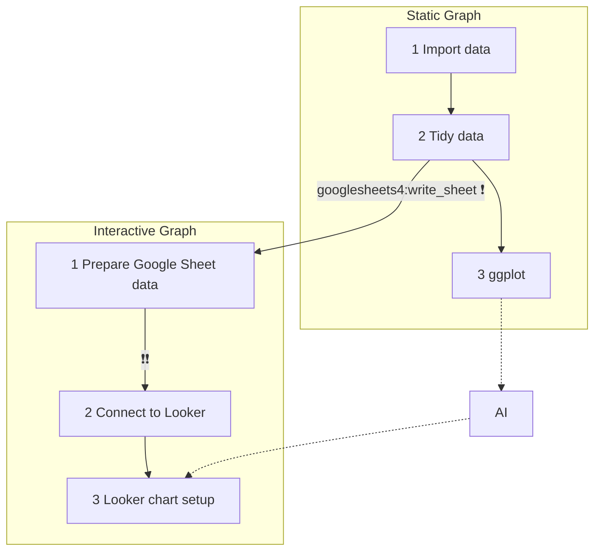
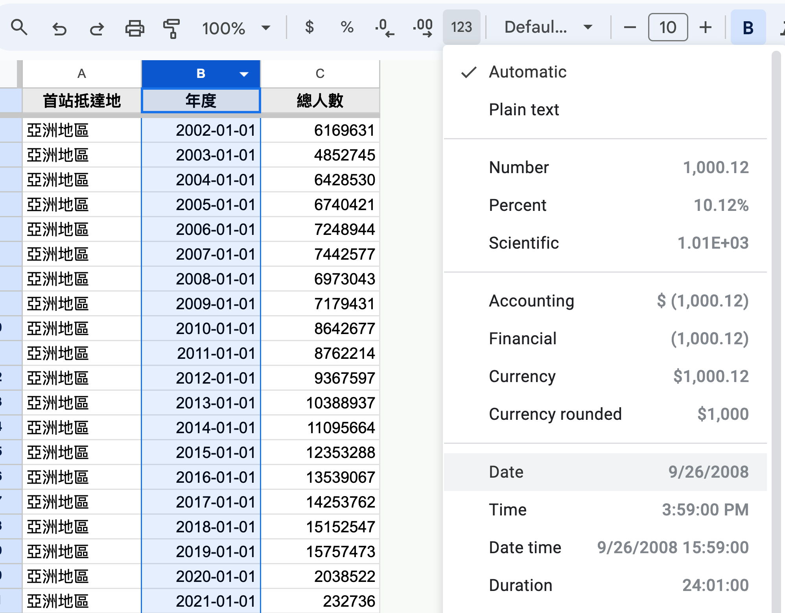

# From R to Google Looker: Google Sheets

  - [Looker Studio](https://lookerstudio.google.com/)

## Flow Chart

> Use R to prepare **tidy data** for Looker Studio as well as its **reference graph** -- if needed.

From **static graph** step 2 to **interactive graph** step 1, 
> ❗ Always double check the classes of the variables in the tidy data. (use `glimpses()`)
> ❗❗ Always double check the format of the columns in the Google Sheet before you connect to Looker.  

### Prepare GSheets data

  1. 確認tidy data的時間變數是date或datetime class 才上傳到GSheets. 
  2. 確認GSheets的時間欄位是date或datetime格式才連接到Looker.

## Exercise: 時間趨勢圖

確認tidy data的時間變數是date或datetime class 才上傳到GSheets, 同時調整GSheets的時間欄位是date或datetime格式.

  - GSheets Url: <https://docs.google.com/spreadsheets/d/1f6sCWRGKCMNDAt2sfbqwR5XqWTpEWNp1jNACkDfKZzo/edit?usp=sharing>  
  

### Teacher Example 1

:star::star::star:

  - [total_people_by_country](https://docs.google.com/spreadsheets/d/1-jX-3EK_yspYDgPIy5vwnRKHntw9-dQIpFVhLc5JcXc/edit?gid=1340188219#gid=1340188219)

### Student Exercise

:star::star::star:

由以下連結下載一個時間序列資料集，並完成以下任務：

  - <https://data.gov.tw/datasets/search?p=1&size=10&s=_score_desc&lgl-3=23315&lgl-4=26234,41221,26230&rct=247>

### Teacher Example 2

:star::star::star::star:

需要良好的AI使用能力。

  - 下載連結中的"[GDP growth](https://docs.google.com/spreadsheets/d/1-jX-3EK_yspYDgPIy5vwnRKHntw9-dQIpFVhLc5JcXc/edit?gid=892490556#gid=892490556)"
 
