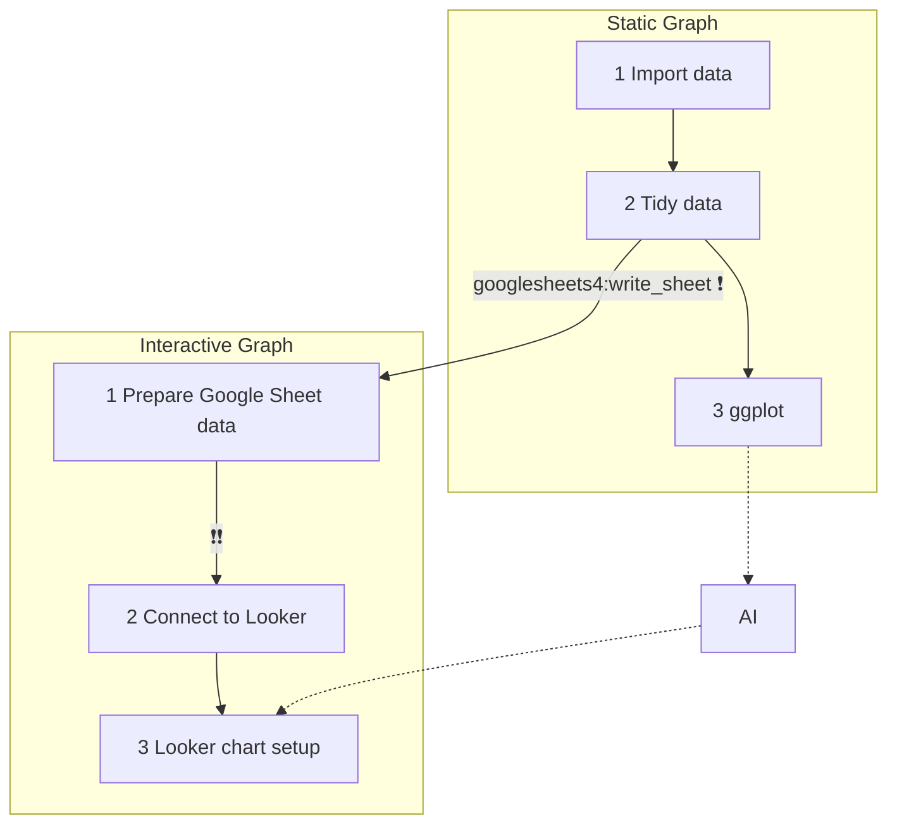

# From R to Google Looker: Tidy Data

  - [Looker Studio](https://lookerstudio.google.com/)

## 1. Flow Chart

> Use R to prepare **tidy data** for Looker Studio as well as its **reference graph** -- if needed.

From **static graph** step 2 to **interactive graph** step 1, 
> ❗ Always double check the classes of the variables in the tidy data. (use `glimpses()`)
> ❗❗ Always double check the format of the columns in the Google Sheet before you connect to Looker.  

### Prepare tidy data

Tidy data: the **last data frame** that is generated or used in codes for a certain task. That data frame is normally referred to as a tidy data frame.  

> For plotting purpose, the data frame used for plotting is a tidy data frame.

## Exercise: 時間趨勢圖

以下的任務均為在R裡完成一個時間趨勢圖（橫軸為時間，縱軸為數值的圖表。）同時理解任務裡的tidy data frame指的是什麼。

### Teacher Example 1

:star::star:

  - [total_people_by_country](https://docs.google.com/spreadsheets/d/1-jX-3EK_yspYDgPIy5vwnRKHntw9-dQIpFVhLc5JcXc/edit?gid=1340188219#gid=1340188219)

### Student Exercise

:star::star::star:

由以下連結下載一個時間序列資料集，並完成以下任務：

  - <https://data.gov.tw/datasets/search?p=1&size=10&s=_score_desc&lgl-3=23315&lgl-4=26234,41221,26230&rct=247>

### Teacher Example 2

:star::star::star::star:

需要良好的AI使用能力。

  - 下載連結中的"[GDP growth](https://docs.google.com/spreadsheets/d/1-jX-3EK_yspYDgPIy5vwnRKHntw9-dQIpFVhLc5JcXc/edit?gid=892490556#gid=892490556)"
 
