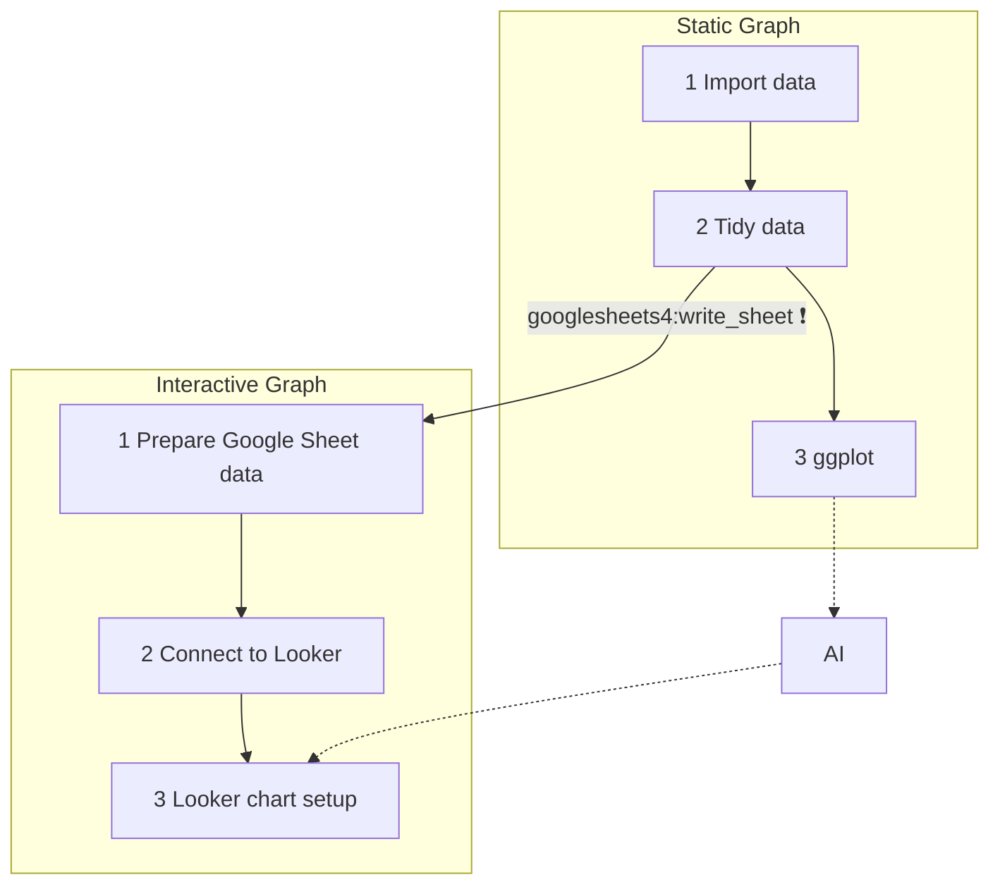
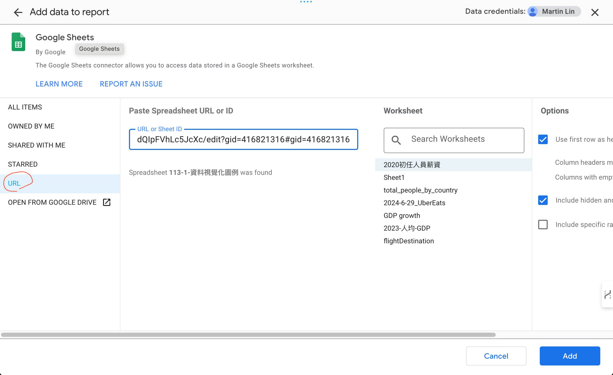
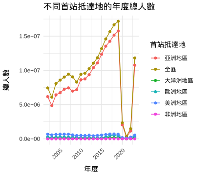

# From R to Google Looker

  - [Looker Studio](https://lookerstudio.google.com/)

<div>
<iframe width="600" height="450" src="https://lookerstudio.google.com/embed/reporting/9d82030f-08db-465d-9df8-824cd1910412/page/3uaEE" frameborder="0" style="border:0" allowfullscreen sandbox="allow-storage-access-by-user-activation allow-scripts allow-same-origin allow-popups allow-popups-to-escape-sandbox"></iframe>
</div>

## 1. Steps

> Use R to prepare tidy data for Looker Studio as well as its reference graph -- if needed.




From **static graph** step 2 to **interactive graph** step 1, 
> ❗ Always double check the classes of the variables in the tidy data.  


## Connect Data

  - How to connect a Google Sheet to Looker Studio?
  


> :exclamation: 如果發現Worksheet清單資料不正確，請重新refresh browser，以確保資料的即時性。

### AI preset


### Example 1

不同首站抵達地的年度總人數
  - [Google Sheet： total_people_by_country](https://docs.google.com/spreadsheets/d/1-jX-3EK_yspYDgPIy5vwnRKHntw9-dQIpFVhLc5JcXc/edit?gid=806824860#gid=806824860)



## AI prompt

AI prompts guidelines

  1. **Clear direction**
  2. **Provide example**
  3. **Specify output/result format**
  4. **Divide task**
  5. **Evaluate quality**
   
```
首站抵達地	年度	總人數
亞洲地區	2002	6169631
亞洲地區	2003	4852745
亞洲地區	2004	6428530

is the first four rows of a Google sheet. How to visualize the data in Google Looker as the attached graph?
```

## AI response

```
To create a chart in Google Looker (Looker Studio) like the one you've uploaded, which appears to be a multi-line chart showing the yearly total number of people arriving at different locations, you can follow these steps:

### Step-by-Step Guide:

1. **Connect the Google Sheet to Looker Studio**:
   - Open Google Looker Studio (formerly Google Data Studio).
   - Click on "Create" → "Data Source".
   - Select "Google Sheets" and connect your Google Sheet containing the data.

2. **Prepare the Data in Looker Studio**:
   - Once connected, select the sheet that contains your data.
   - Ensure the columns are correctly recognized:
     - `首站抵達地` (First Arrival Location) as a **Dimension**.
     - `年度` (Year) as a **Dimension**, and set it to **number**.
     - `總人數` (Total Number of People) as a **Metric**.

3. **Create the Chart**:
   - After the data is connected, click on **Create** → **New Report**.
   - Choose **Add a Chart** and select **Time Series** (for line charts).
   - Drag your `年度` (Year) dimension to the **X-axis** and `總人數` (Total Number of People) to the **Y-axis**.

4. **Configure the Series**:
   - In the chart settings, under the **Dimension** section, drag the `首站抵達地` (First Arrival Location) to the "Series" field to separate the lines by location.
   - This will create a multi-line graph where each line represents a different location.

5. **Customize the Chart**:
   - In the **Style** tab, you can:
     - Change the color of each line to match the colors in your graph.
     - Add points on the line (like in your example).
     - Customize the legend and position it to the right.
   - Add a title to the chart by clicking on the chart title area and editing it to match your example: "不同首站抵達地的年度總人數".

6. **Final Adjustments**:
   - Adjust the axes titles by editing them to display `年度` (Year) for the X-axis and `總人數` (Total Number of People) for the Y-axis.
   - Set the Y-axis to a logarithmic scale (if needed) for better visualization of data variations.
   - Customize the font size and styles to match the look of your reference chart.

### Outcome:
You should now have a chart similar to the one you've shared, with multiple colored lines representing different arrival locations over time.
```

## Interactive Graph Design Guidelines

Design proper interactive graph in an interactive user interface can be messy. Use R program with the help of AI to design a reasonable graph. 

  1. Save the graphing data to Google Sheets.  
  2. Save the graph and upload to AI chatbot, then ask for the interactive graph design with example sheet data provided. 

