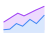
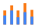
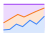
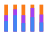

# Categorical variable and Stacked graph

> :exclamation: 減少視覺呈現的類別數量（包含"其他"類，盡量不超過5類），讓觀眾更容易理解故事。

## Example

### 引入及初步處理資料

<https://github.com/tpemartin/113-1-data-visualization/blob/09a50137f0c8aa11df61ff5b3e519bb2b57f5f35/R/week7-preparation.R#L2-L15>

繪圖  
<https://github.com/tpemartin/113-1-data-visualization/blob/09a50137f0c8aa11df61ff5b3e519bb2b57f5f35/R/week7-preparation.R#L17-L28>

目前圖例順序

<https://github.com/tpemartin/113-1-data-visualization/blob/09a50137f0c8aa11df61ff5b3e519bb2b57f5f35/R/week7-preparation.R#L42>

### 調整圖例順序

以總人數排序

<https://github.com/tpemartin/113-1-data-visualization/blob/09a50137f0c8aa11df61ff5b3e519bb2b57f5f35/R/week7-preparation.R#L44-L48>

### 減少類別

減少成前四名，及"其他"類

<https://github.com/tpemartin/113-1-data-visualization/blob/09a50137f0c8aa11df61ff5b3e519bb2b57f5f35/R/week7-preparation.R#L52-L67>

繪圖

<https://github.com/tpemartin/113-1-data-visualization/blob/09a50137f0c8aa11df61ff5b3e519bb2b57f5f35/R/week7-preparation.R#L74-L81>

## Stacked graph （堆疊圖）

分成一般的Stacked graph和100% Stacked graph的變形。

## 一般的Stacked graph

Stacked Area Chart

|  |  |  |
|:--:| :--: | :--: |
| Stacked Area Chart | Stacked Column Chart | Stacked Bar Chart |

 
  * 底層的資料最容易判讀（儘量留給故事主角類別）。
  * 總高度有"總計"的概念。

> :exclamation: 當故事有"主角"類別且"總計"也是重要的時候，Stacked graph是一個好選擇。

  * Column/Bar chart的差別在於，各類別資料的長度，前者是欄位給定，後者是該類別的資料筆數。

<https://github.com/tpemartin/113-1-data-visualization/blob/1ed2bea3563a6d1dae40ab37a8ab145356b2277c/R/week7-preparation.R#L84-L92>

## 100% Stacked graph

|  |  |  | 
|:--:| :--: | :--: |
| 100% Stacked Area Chart | 100% Stacked Column Chart | 100% Stacked Bar Chart |

  * 每個類別的資料長度都是100%。  
  * 堆疊的最低層和最高層的變化趨勢最容易判讀。  
  
> :exclamation: 當故事有"1～2個重要角色"且"佔比"也是重要的時候，100% Stacked graph是一個好選擇。

<https://github.com/tpemartin/113-1-data-visualization/blob/1ed2bea3563a6d1dae40ab37a8ab145356b2277c/R/week7-preparation.R#L94-L102>

## Stacking Order

  * It follows the levels of the factor variable. `levels()` function can be used to check the order of the levels.

<https://github.com/tpemartin/113-1-data-visualization/blob/1ed2bea3563a6d1dae40ab37a8ab145356b2277c/R/week7-preparation.R#L104-L125>  