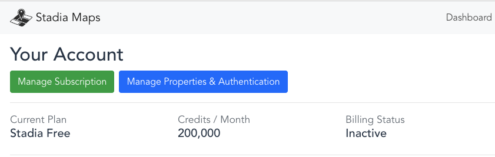
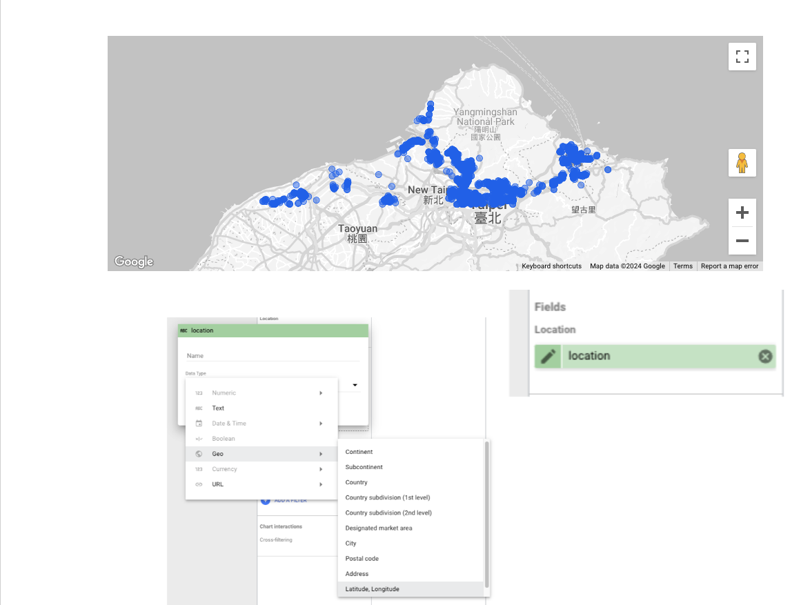

# Map: ggmap

## ggmap package

### 1. Stadia maps

You can explore the map centering Taiwan through

<https://stadiamaps.com/explore-the-map/#map=7.67/23.51/120.869>

    - `#map=zoom/latitude/longitude`

#### Register API

Dashboard > Manage Properties & Authentication 

Once you have your API key, invoke the registration function: `register_stadiamaps("YOUR-API-KEY", write = FALSE)`. Note that setting write = TRUE will update your ~/.Renviron file by replacing/adding the relevant line. If you use the former, know that you’ll need to re-do it every time you reset R.

## Looker studio

