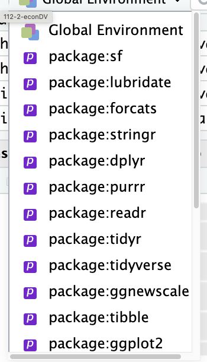

# Geographical Information Systems

## What is GIS?

A Geographic Information System (GIS) is a system designed to capture, store, manipulate, analyze, manage, and present spatial or geographic data. The acronym GIS is sometimes used for Geographic Information Science (GIScience) to refer to the academic discipline that studies geographic information systems and is a large domain within the broader academic discipline of geoinformatics. What goes beyond a GIS is a spatial data infrastructure, a concept that has no such restrictive boundaries.

## GIS in R: `sf` package

R has a number of packages for working with spatial data. The most important of these is the `sf` package, which provides a simple way to work with spatial data in R. The `sf` package is built on top of the `sp` package, which is the original spatial data package for R. The `sf` package is designed to be easier to use than the `sp` package, and it provides a more modern and consistent interface for working with spatial data.

[`sf` cheatsheet](https://github.com/rstudio/cheatsheets/blob/main/sf.pdf)

## GIS Data Types

[](https://data.gov.tw/datasets/search?p=1&size=10&s=_score_desc&rft=%E5%9C%B0%E5%9C%96)

# AI assistant

AI》  

> ```For geographical simple feature data (data frame with geometry simple feature column), always use `geom_sf` for plotting unless impossible. When simplifying simple features, always use `st_simplify` with `preserveTopology = TRUE` and `dTolerance =1`.```


# GIS plottiing

## Simple Feature

Simple Feature是一種空間資料的結構，包含以下幾何類型：  

  - 點（point）：   
  - 連線（line string）  
  - 多邊體（polygon）  
  - 多點（multipoint）  
  - 多連線（multilinestring）  
  - 多多邊體（multipolygon）
  
另外還有：

  - bounding box: 空間資料的邊界框
  - CRS (coordinate reference system): 空間資料的座標參考系統
  
### shp file

一組shp檔案通常包含以下幾個檔案：

- .shp：包含幾何形狀的檔案
- .shx：包含幾何形狀的索引檔案
- .dbf：包含屬性資料的檔案

等等，這群檔案要放在同一資料夾下，才能正確讀取。

AI》
> ```How to read shp file```

### 簡化空間資料

  - 保留拓撲關係（preserve topology）：`preserveTopology = TRUE`  
  - 簡化容錯（tolerance）：`dTolerance = 1` ，值越大，簡化程度越高

AI》
> ```How to simplify simple features```


### sf 引入順序



> 留意sf要在最靠近Global environment的位置，至少比dplyr還要靠近。

<!--
### OpenStreetMap

[Open Steet Map](https://tpemartin.github.io/economic-data-visualization/zh-tw/annotation-and-maps.html#open-street-map-osm)

AI》
> ```How to download simple feature from  OpenStreetMap```

-->

## `geom_sf`

ggplot主要用`geom_sf`來處理地點圖層，不用`geom_point`、`geom_polygon`等，data input必需是只帶有一種基本幾何的data frame, 稱為simple feature (data frame). 如果有多幾基本幾何則使用多層`geom_sf`來層疊，只需記得

> 每一層所使用的simple feature只帶有一種基本幾何。

。`geom_sf`是`sf`套件的一部分，用來處理空間資料。`sf`套件是`sp`套件的後繼者，用來處理空間資料。`sf`套件的資料結構是`sf`，`sp`套件的資料結構是`sp`。`sf`套件的資料結構是`data.frame`，`sp`套件的資料結構是`Spatial`。`sf`套件的資料結構是`data.frame`，所以可以用`dplyr`套件的函數來處理資料。`sp`套件的資料結構是`Spatial`，所以不能用`dplyr`套件的函數來處理資料。

## 範例程式1

```r
library(tidyverse)
# Reading a shapefile -----
shapeData <- st_read("COUNTY_MOI_1090820.shp")
glimpse(shapeData)

class(shapeData)

# Simplifying shapeData simple feature -----
simplified_shape <- st_simplify(shapeData,
                                preserveTopology = TRUE, 
                                dTolerance = 2)
glimpse(simplified_shape)

ggplot()+
  geom_sf(
    data=simplified_shape
  )

# Obtaining bounding box -----
bbox <- st_bbox(simplified_shape)
bbox

bbox["ymin"] <- 21

simplified_shape <- 
  st_crop(simplified_shape,
          bbox)

ggplot()+
  geom_sf(
    data=simplified_shape
  )

object.size(simplified_shape)

```

## Overlay ggmap

  - <https://stackoverflow.com/questions/47749078/how-to-put-a-geom-sf-produced-map-on-top-of-a-ggmap-produced-raster>

The map from ggmap use different bbox definition from the bbox used in simple feature plotting. We need to hack the map's bbox definition so that it can fit to use in the coordinate system of simple feature plotting. On top of that ggmap's map are in EPSG:3857 crs. We need to transform the simple feature data to EPSG:3857 crs before overlaying it on the ggmap.


<details>
<summary> ggmap hacking code </summary>

```r
# Define a function to fix the bbox to be in EPSG:3857
ggmap_bbox <- function(map) {
  if (!inherits(map, "ggmap")) stop("map must be a ggmap object")
  # Extract the bounding box (in lat/lon) from the ggmap to a numeric vector, 
  # and set the names to what sf::st_bbox expects:
  map_bbox <- setNames(unlist(attr(map, "bb")), 
                       c("ymin", "xmin", "ymax", "xmax"))

  # Coonvert the bbox to an sf polygon, transform it to 3857, 
  # and convert back to a bbox (convoluted, but it works)
  bbox_3857 <- st_bbox(st_transform(st_as_sfc(st_bbox(map_bbox, crs = 4326)), 3857))

  # Overwrite the bbox of the ggmap object with the transformed coordinates 
  attr(map, "bb")$ll.lat <- bbox_3857["ymin"]
  attr(map, "bb")$ll.lon <- bbox_3857["xmin"]
  attr(map, "bb")$ur.lat <- bbox_3857["ymax"]
  attr(map, "bb")$ur.lon <- bbox_3857["xmax"]
  map
}

# Use the function:
tw_map_hack <- ggmap_bbox(tw_map)

ggmap(tw_map_hack) + 
  coord_sf(crs = st_crs(3857)) + # force the ggplot2 map to be in 3857
  geom_sf(
    data = tw_shp_crop |>
           st_transform(crs = 3857),
    fill = "blue",
    color = "white",
    alpha = 0.5,
    inherit.aes = FALSE
  )
```

</details>

It is not easy to remember this. So I create a package `ntpudatavis` with a function `ntpudatavis::ggmap_bbox()`. Once you install that you always have `ggmap_bbox()` function to hack the ggmap object to fit the simple feature plotting.

On top of that we add the following AI prompt:

> When asked to overlay simple feature on ggmap, always call `ntpudatavis::ggmap_bbox(map)` to get a `revised_map` from the return -- here `map` is from `ggmap::get_xxxmap()`. Then use `ggmap(revised_map)+coord_sf(crs = st_crs(3857))` to build the ggmap underlayer for `geom_sf` to overlay. The simple feature used in `geom_sf` must be `st_transform(simple_feature_data, crs = 3857)` transformed. 

In the future, you can ask AI to generate the code with some prompt like:

> How to overlay a simple feature data `tw_shp_crop` on a ggmap map `tw_map`.