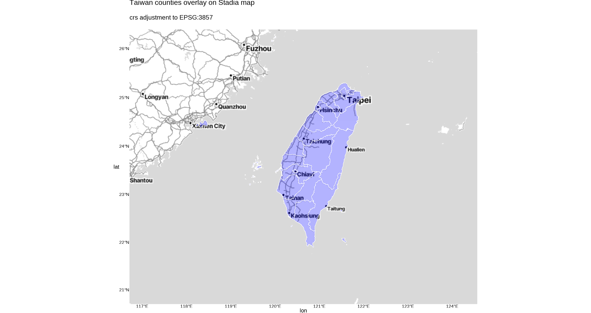
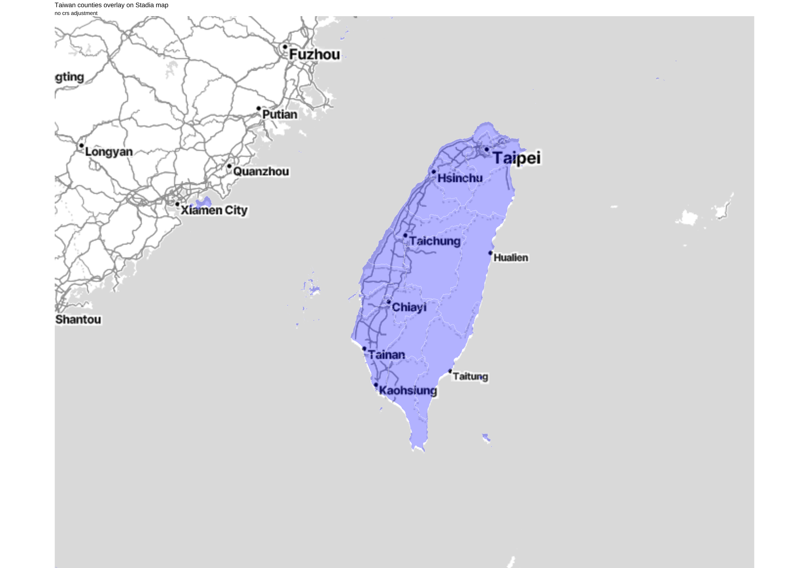

# Simple Feature and ggmap



`ggamp(map)+geom_sf(data=simple_feature_data)`

## Simple feature plot

<details>
<summary> code </summary>

<https://github.com/tpemartin/113-1-data-visualization/blob/5f89897c659c16a96af72f32eb3d5c6dae8c148b/R/week12-preparation.R#L2-L27>

</details>

## Overlay ggmap


`ggmap(map_from_get_map)+geom_sf(data=simple_feature_data)` 

will have simple feature geom overlay on ggmap

### Request ggmap

<details>
<summary> code </summary>

<https://github.com/tpemartin/113-1-data-visualization/blob/5f89897c659c16a96af72f32eb3d5c6dae8c148b/R/week12-preparation.R#L32-L50>

</details>

### Direct overlay

<details>

<summary> code </summary>

<https://github.com/tpemartin/113-1-data-visualization/blob/5f89897c659c16a96af72f32eb3d5c6dae8c148b/R/week12-preparation.R#L53-L65>

</details>



:exclamation: :exclamation: :exclamation: with two problems to solve:

  1. `geom_sf` and `ggmap` use different aesthetics. The above code will have `geom_sf()` inherit the aesthetics from `ggmap()`. To avoid this, set `inherit.aes=FALSE` in `geom_sf()`.
   > `ggmap(map)+geom_sf(data=simple_feature_data, inherit.aes=FALSE)`  
  2. The bbox and crs difference. 

## bbox and crs incompatibility

The map from ggmap 

  1. use a **different bbox definition** from the bbox used in simple feature plotting. We need to hack the map's bbox definition so that it can fit to use in the coordinate system of simple feature plotting. On top of that... 
  2. use a **different coordination reference system (crs)** for projection. It is EPSG:3857 crs used in ggmap's map tiles. We need to **transform the simple feature data to EPSG:3857 crs** before overlaying it on the ggmap.


<details>
<summary> ggmap hacking code </summary>

Reference:  
  - <https://stackoverflow.com/questions/47749078/how-to-put-a-geom-sf-produced-map-on-top-of-a-ggmap-produced-raster>

```r
# Define a function to hack bbox of ggmap's map object
ggmap_bbox <- function(map) {
  if (!inherits(map, "ggmap")) stop("map must be a ggmap object")
  # Extract the bounding box (in lat/lon) from the ggmap to a numeric vector, 
  # and set the names to what sf::st_bbox expects:
  map_bbox <- setNames(unlist(attr(map, "bb")), 
                       c("ymin", "xmin", "ymax", "xmax"))

  # Coonvert the bbox to an sf polygon, transform it to 3857, 
  # and convert back to a bbox (convoluted, but it works)
  bbox_3857 <- st_bbox(st_transform(st_as_sfc(st_bbox(map_bbox, crs = 4326)), 3857))

  # Overwrite the bbox of the ggmap object with the transformed coordinates 
  attr(map, "bb")$ll.lat <- bbox_3857["ymin"]
  attr(map, "bb")$ll.lon <- bbox_3857["xmin"]
  attr(map, "bb")$ur.lat <- bbox_3857["ymax"]
  attr(map, "bb")$ur.lon <- bbox_3857["xmax"]
  map
}

# Hack the bbox of the a map from ggmap, say tw_map
tw_map_hack <- ggmap_bbox(tw_map)

# Overlay the simple feature data tw_shp_crop on the ggmap
ggmap(tw_map_hack) + 
  geom_sf(
    data = tw_shp_crop |>
           st_transform(crs = 3857),
    fill = "blue",
    color = "white",
    alpha = 0.5,
    inherit.aes = FALSE
  )
```

</details>

It is not easy to remember the definition of `ggmap_bbox()`. So I create a package `ntpudatavis` with such a function `ntpudatavis::ggmap_bbox()`. Once you install that you always have `ggmap_bbox()` function to use.

```r
remotes::install_github("tpemartin/ntpudatavis")
```

On top of that we add the following AI prompt:

> When asked to overlay simple feature on ggmap, always call `ntpudatavis::ggmap_bbox(map)` to get a `revised_map` from the return -- here `map` is from `ggmap::get_xxxmap()`. Then use `ggmap(revised_map)` to build the ggmap underlayer for `geom_sf` to overlay. The simple feature used in `geom_sf` must be `st_transform(simple_feature_data, crs = 3857)` transformed. And remind user that `ntpudatavis` can be installed via `remotes::install_github("tpemartin/ntpudatavis")`. 

In the future, you can ask AI to generate the code with a simple prompt like:

> How to overlay a **simple feature** data `tw_shp_crop` on a **ggmap map** `tw_map`.

<details>

<summary> code </summary>

<https://github.com/tpemartin/113-1-data-visualization/blob/5f89897c659c16a96af72f32eb3d5c6dae8c148b/R/week12-preparation.R#L67-L81>

</details>