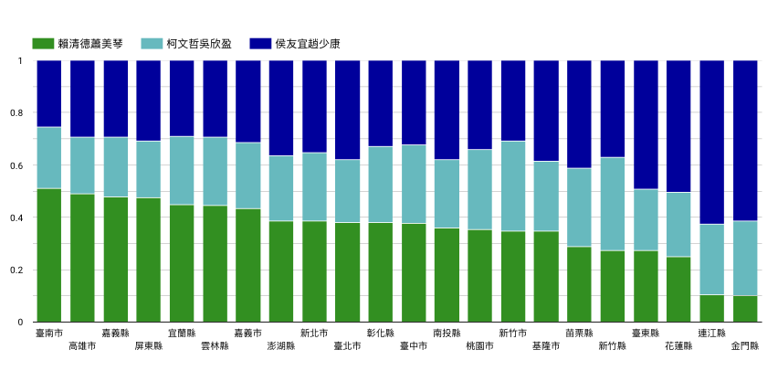
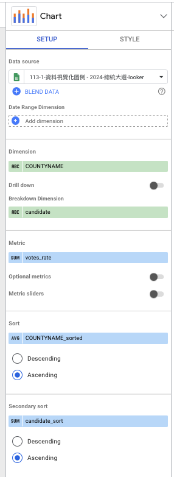
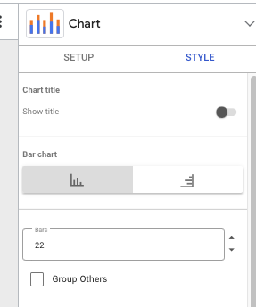

# Column chart

[](https://lookerstudio.google.com/reporting/9d82030f-08db-465d-9df8-824cd1910412/page/p_34xtbpnbnd)

## Connected data

<https://docs.google.com/spreadsheets/d/1-jX-3EK_yspYDgPIy5vwnRKHntw9-dQIpFVhLc5JcXc/edit?gid=900775092#gid=900775092>

## Two calculated fields

For each sorting you need to create two calculated fields. One for the COUNTYNAME (i.e. `COUNTYNAME_sorted`) and one for candidate (i.e. `candidate_sort`).

<details>
<summary> COUNTYNAME_sorted </summary>

```
CASE
  WHEN COUNTYNAME = "臺南市" THEN 1
  WHEN COUNTYNAME = "高雄市" THEN 2
  WHEN COUNTYNAME = "嘉義縣" THEN 3
  WHEN COUNTYNAME = "屏東縣" THEN 4
  WHEN COUNTYNAME = "宜蘭縣" THEN 5
  WHEN COUNTYNAME = "雲林縣" THEN 6
  WHEN COUNTYNAME = "嘉義市" THEN 7
  WHEN COUNTYNAME = "澎湖縣" THEN 8
  WHEN COUNTYNAME = "新北市" THEN 9
  WHEN COUNTYNAME = "臺北市" THEN 10
  WHEN COUNTYNAME = "彰化縣" THEN 11
  WHEN COUNTYNAME = "臺中市" THEN 12
  WHEN COUNTYNAME = "南投縣" THEN 13
  WHEN COUNTYNAME = "桃園市" THEN 14
  WHEN COUNTYNAME = "新竹市" THEN 15
  WHEN COUNTYNAME = "基隆市" THEN 16
  WHEN COUNTYNAME = "苗栗縣" THEN 17
  WHEN COUNTYNAME = "新竹縣" THEN 18
  WHEN COUNTYNAME = "臺東縣" THEN 19
  WHEN COUNTYNAME = "花蓮縣" THEN 20
  WHEN COUNTYNAME = "連江縣" THEN 21
  WHEN COUNTYNAME = "金門縣" THEN 22
  ELSE NULL
END
```

</details>

<details>

<summary>candidate_sort</summary>

```
CASE
  WHEN candidate = "賴清德蕭美琴" THEN 1
  WHEN candidate = "柯文哲吳欣盈" THEN 2
  WHEN candidate = "侯友宜趙少康" THEN 3
END
```

</details>

## Properties



## Visible Bars

