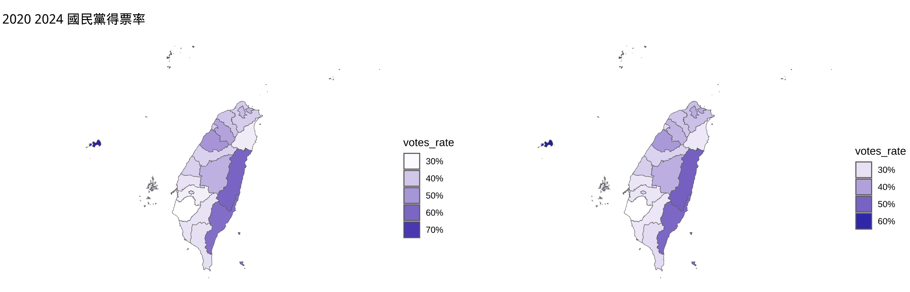
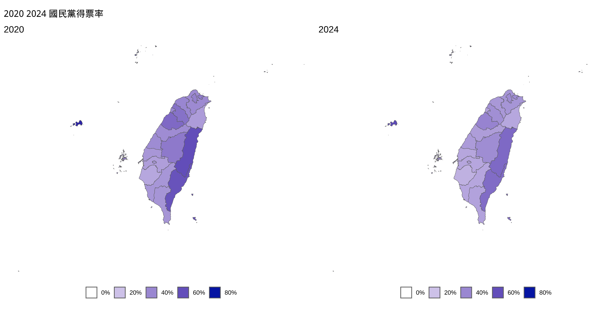

# Gradient fill/color

Gradient (meaning **continuous(連續)** variation) fill/color is a common aesthetic in ggplot2. It is used to fill the area under a curve or a polygon with a color gradient. The gradient can be a single color gradient or a gradient between two colors. 

## 2024 總統大選

### 1. 引入總統大選資料

<https://github.com/tpemartin/113-1-data-visualization/blob/49f6220691476e12f561328cb13026bec2dd52d7/R/week13-election-choropleth.R#L266-L273>

***

創立party變數，及算各行政區各candidate得票率

<https://github.com/tpemartin/113-1-data-visualization/blob/6d4552de2945ce62e4bf04ba68b4d1c89fc767f3/R/week13-election-choropleth.R#L275-L286>

### 2. 併入台灣simple feature

<https://github.com/tpemartin/113-1-data-visualization/blob/5ebce6c3ddc119f518264d94ff9d5b2322574124/R/week13-election-choropleth.R#L288-L293>

> :exclamation: 記住是`sf_df <- sf_df |> left_join(regular_df, by=...)` 方式併入sf object以確保sf class

## Exercise 2020 總統大選

<https://github.com/tpemartin/113-1-data-visualization/blob/da315a89bfb40abc1a0af88cdd99aa5884f9b770/R/week13-election-choropleth.R#L295-L300>

## Choropleth map (面量圖)

<https://github.com/tpemartin/113-1-data-visualization/blob/0317da6f040f5300bae82d8bef47001f106590d9/R/week13-election-choropleth.R#L330-L361>

<https://github.com/tpemartin/113-1-data-visualization/blob/0317da6f040f5300bae82d8bef47001f106590d9/R/week13-election-choropleth.R#L363-L368>

> :exclamation: `fill`美學mapping，內訂是以資料的最大值及最小值來map到fill裡的low及high, 不同年度的資料可能有不同的最大值及最小值，所以要設定`limits`參數來固定最大值及最小值

## Set limits

When graph uses gradient fill aesthetic but no limits are provided, ask for the limits. When limits are provided, use the limits. If the limits are not provided, use the limits from the data. 

<https://github.com/tpemartin/113-1-data-visualization/blob/0317da6f040f5300bae82d8bef47001f106590d9/R/week13-election-choropleth.R#L370-L421>

