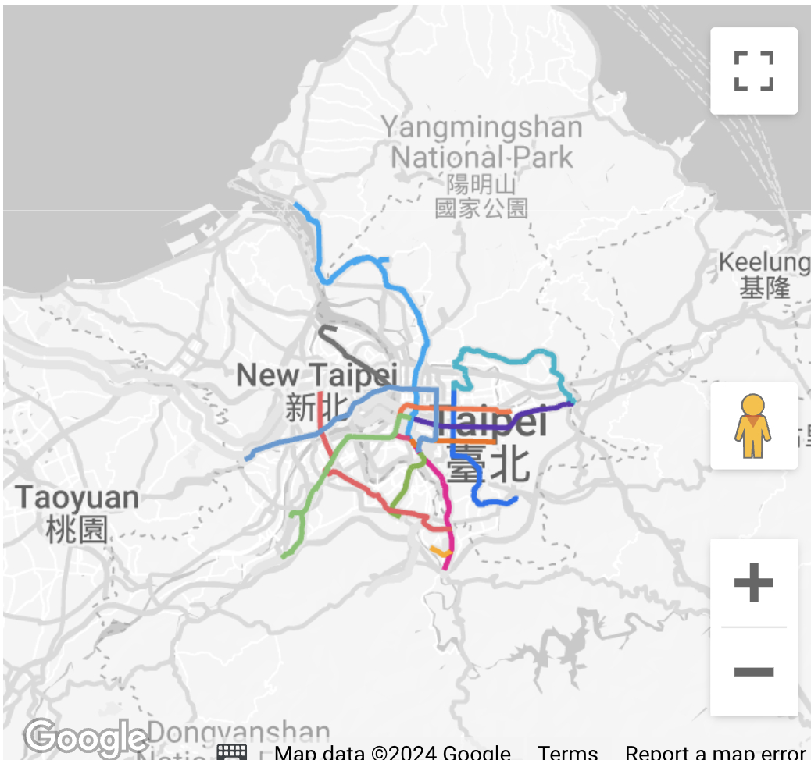
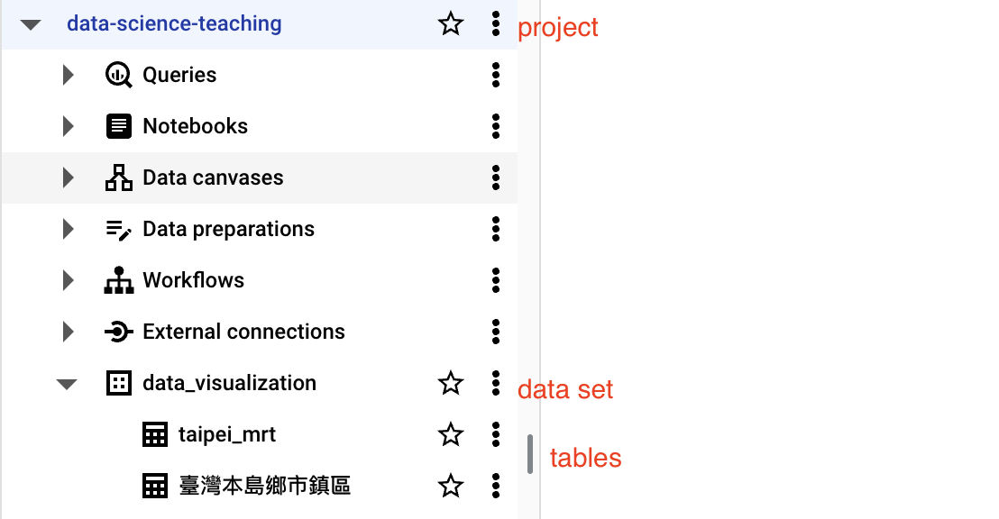
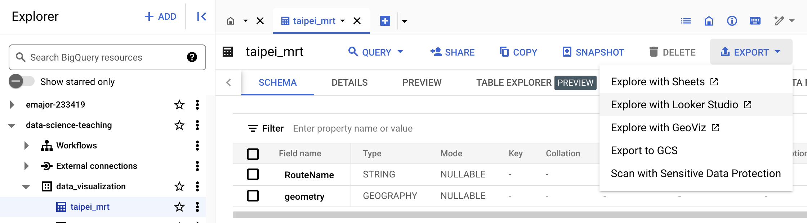

# Simpe Feature and BigQuery


[](https://lookerstudio.google.com/reporting/e22e7a31-3ff5-4ebf-b8e0-eb89ea791b53)

Looker studio對於simple feature要求必需是來自BigQuery的GEOGRAPHY data type：

   - 如何將simple feature上傳到BigQuery成為GEOGRAPHY data

## 台北捷運線

### GeoJSON

  - <https://data.gov.tw/dataset/121208>

> GeoJSON 是另一種可以用來儲存地理資訊的格式，它是一種基於 JSON 的格式，可以用來表示地理特徵、空間物件、坐標點等等。GeoJSON 是一種開放的格式，可以用來儲存地理資訊，並且可以被許多地理資訊系統所支援。引入到R中一樣會是個simple feature data frame。

### 引入

```r
# taipei mrt -----
library(sf)

taipei_mrt <- sf::st_read("https://raw.githubusercontent.com/tpemartin/113-1-data-visualization/refs/heads/main/public-data/TpeMRTRoutes_TWD97_%E8%87%BA%E5%8C%97%E9%83%BD%E6%9C%83%E5%8D%80%E5%A4%A7%E7%9C%BE%E6%8D%B7%E9%81%8B%E7%B3%BB%E7%B5%B1%E8%B7%AF%E7%B6%B2%E5%9C%96-121208.json")
```

## ggmap ggplot繪圖

  - 試著使用AI畫出有stadia map底圖的捷運路線圖[^2]。
  
# Looker Studio繪圖

要能在Looker Studio上繪製simple feature，必須先將simple feature上傳到BigQuery成為GEOGRAPHY data type。   

# BigQuery

BigQuery is a serverless, highly scalable, and cost-effective multi-cloud data warehouse designed for business agility. It enables super-fast SQL queries using the processing power of Google's infrastructure.

## BigQuery Studio 
**Open BigQuery**

[課程Bq dataset分享連結](https://console.cloud.google.com/bigquery?ws=!1m4!1m3!3m2!1sdata-science-teaching!2sdata_visualization)

Need to authorize for the first time. 
 

***



  - project id: data-science-teaching
  - dataset id:  data_visualization  
  - table name: taipei_mrt, etc.

> :exclamation: **注意**：在BigQuery Studio上，table name不要有空格, 並且table name不要有特殊符號。

## 上傳Simple Feature到BigQuery


### bigrquery package

**Install the Necessary Packages**:
   
   ```r
   install.packages("bigrquery")
   ```

**Authenticate**:

`bigrquery::bq_auth()`


### Upload Simple Feature to BigQuery

1. 轉換simple feature
   - crs轉換成4326，確保座標系統為Google map使用的格式。
   - geometry成WKT格式[^1]的單純character class。
   - 將simple feature轉換成單純的data frame。
2. 準備在BigQuery中的fields (相當於R裡的class parsing)
   - 將geometry field設定為GEOGRAPHY data type。
3. 準備上傳BigQuery成為一個table (相當於R裡的data frame)  
   - project id, date set id, table name 設定。
   - 準備好的fields設定。
   - 轉換好的data frame。

### 使用AI preset

<https://github.com/tpemartin/113-1-data-visualization/blob/504a66ad89f2d5115ca456ad5ab13a06ef865fe8/Lecture-notes/AI.md?plain=1#L40-L82>

## Export to Looker Studio


Find the table and export to Looker Studio.  
 


## R and BigQuery

  - dplyr package: <https://dbplyr.tidyverse.org/>

<https://github.com/tpemartin/113-1-data-visualization/blob/edd6dc957824fcedb6bbba84fbe149537d2fb0a1/R/week15.R#L43-L53>

[^1]: WKT (Well-Known Text) is a text markup language for representing vector geometry objects. It is used to describe the spatial data in a human-readable format.  
[^2]: [參考對話](https://github.com/tpemartin/113-1-data-visualization/blob/main/chat/taipei-mrt-overly-stadia-map.txt)